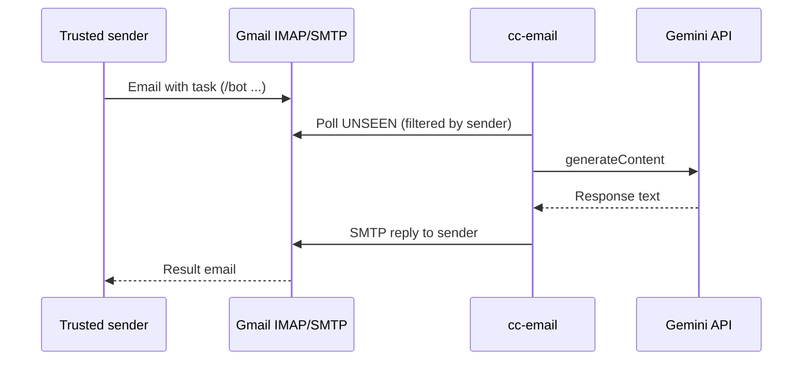

<div align="center">
 
</div>

# cc-email

[](https://github.com/meloalright/cc-email/actions/workflows/ci.yml) [](LICENSE)

Bridge between **email** and **AI agents**. Send a task from your inbox, get the reply by email — no public IP, no webhook server, no self-hosted SMTP.

This fork uses **[Google Gemini](https://ai.google.dev/)** (`gemini-2.5-flash-lite` by default) as the agent backend.

## How it works



1. You email the **inbox account** from an address on the **allowlist**.
2. `cc-email` polls Gmail over IMAP, runs the prompt through Gemini, and sends the answer back via SMTP.

## Quick start (Gmail + Gemini)

### 1. Prerequisites

- Rust toolchain ([rustup](https://rustup.rs/)) or install via Homebrew/npm (see below)
- A Gmail account with **IMAP enabled**
- A Gmail **App Password** ([create one](https://myaccount.google.com/apppasswords))
- A **Gemini API key** ([Google AI Studio](https://aistudio.google.com/apikey))

### 2. Clone and build

```bash
git clone https://github.com/YOUR_USERNAME/cc-email.git
cd cc-email
cargo build --release
```

### 3. Configuration (keep your email private)

**Do not commit real addresses.** The repo only ships a template:

```bash
cp cc-email-gmail.toml.example cc-email-gmail.toml
```

Edit `cc-email-gmail.toml` locally:

| Field | Meaning |
|--------|---------|
| `username` / `from` | Gmail account that **receives** tasks and **sends** replies |
| `allowed_senders` | Who may trigger the bot (your personal email, etc.) |
| `search_from` | IMAP filter — only fetch UNSEEN mail from these senders |

Example (placeholders):

```toml
[inbox]
username = "my-bot@gmail.com"
search_from = ["me@personal.com"]

[outbox]
from = "my-bot@gmail.com"

[agent]
type = "gemini"
api_key_env = "GEMINI_API_KEY"
model = "gemini-2.5-flash-lite"

[security]
allowed_senders = ["me@personal.com"]
```

`cc-email-gmail.toml` is listed in `.gitignore` so it stays on your machine.

### 4. Environment variables

```bash
export CC_EMAIL_GMAIL_PASSWORD="xxxx xxxx xxxx xxxx"
export GEMINI_API_KEY="your-api-key"
```

### 5. Run

```bash
./target/release/cc-email listen --config cc-email-gmail.toml
```

Send an email **from** an allowed address **to** the inbox account, e.g. subject `/bot` and body: *Write a simple Python calculator for learning.*

## Install (optional)

```sh
# Homebrew
brew install meloalright/tap/cc-email

# npm (may lag behind this repo)
npm install -g cc-email
```

For Gemini support, building from source is recommended.

## GitHub Actions (24/7 bot)

Workflow: [`.github/workflows/bot.yml`](.github/workflows/bot.yml) — manual **workflow_dispatch**.

### Repository secrets

Add under **Settings → Secrets and variables → Actions**:

| Secret | Description |
|--------|-------------|
| `GEMINI_API_KEY` | Gemini API key |
| `CC_EMAIL_GMAIL_PASSWORD` | Gmail App Password |
| `CC_EMAIL_GMAIL_USER` | Inbox/outbox Gmail address (e.g. `bot@gmail.com`) |
| `CC_EMAIL_ALLOWED_SENDER` | Trusted sender allowed to use the bot |

The workflow generates `cc-email-gmail.toml` at runtime from `cc-email-gmail.toml.example` — **no private email in the repository**.

### Quota / billing

If you see `HTTP 429` or `limit: 0`:

- Prefer `gemini-2.5-flash-lite` (higher free-tier limits).
- Check usage: [ai.dev/rate-limit](https://ai.dev/rate-limit).
- Some projects need billing enabled (free tier still applies): [Gemini billing docs](https://ai.google.dev/gemini-api/docs/billing).

## Email commands

Send as subject or first line of the body:

| Command | Description |
|---------|-------------|
| `/bot …` | Run agent on the message body |
| `/new` | New session |
| `/help` | List commands |
| `/doctor` | Diagnostics |
| `/usage` | Token usage (Gemini) |
| `/model` | Show or switch model |

## Security

- **`allowed_senders`** — reject mail from anyone else.
- **`search_from`** — IMAP only fetches UNSEEN mail from trusted senders (fewer false triggers).
- **Secrets** — passwords and API keys via environment variables, never in git.
- **Size limits** — `max_body_bytes`, `max_attachment_bytes` in config.

## Privacy for public repositories

| Safe to commit | Keep local / Secrets |
|----------------|----------------------|
| `cc-email-gmail.toml.example` | `cc-email-gmail.toml` |
| `README.md`, source code | `CC_EMAIL_GMAIL_PASSWORD`, `GEMINI_API_KEY` |
| GitHub Actions workflow | `CC_EMAIL_GMAIL_USER`, `CC_EMAIL_ALLOWED_SENDER` |

If you previously committed `cc-email-gmail.toml` with real addresses:

```bash
git rm --cached cc-email-gmail.toml
git commit -m "Stop tracking private Gmail config"
```

Old commits may still contain addresses in git history; rotate App Passwords if the repo was public.

## Architecture

```
src/
├── main.rs              # CLI
├── engine.rs            # Poll loop, task orchestration
├── config.rs            # TOML config
├── security.rs          # Sender allowlist
├── inbox/imap_poll.rs   # IMAP polling
├── mail/                # Parse & SMTP reply
├── agent/
│   ├── gemini_agent.rs  # Gemini REST API
│   └── command_runner.rs
├── session/             # Per-sender sessions
└── command/builtins.rs  # /help, /new, …
```

## Other providers

Any **IMAP + SMTP** provider works. Adjust `host`, `port`, and credentials in a custom TOML file (copy the example as a starting point).

## Acknowledgements

Inspired by [cc-connect](https://github.com/chenhg5/cc-connect).

## License

MIT
